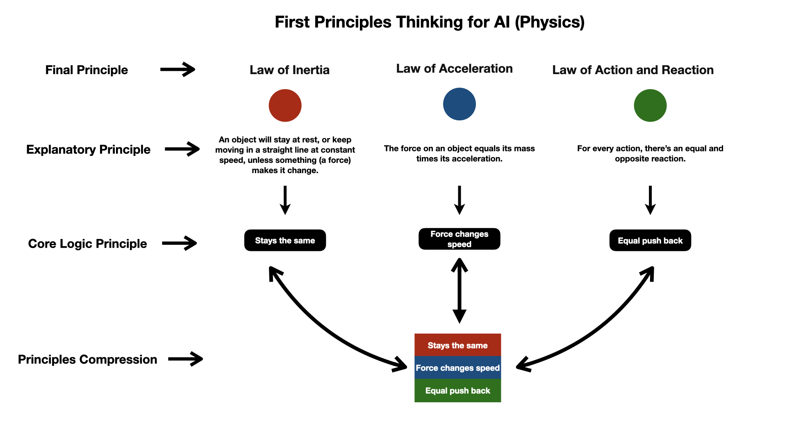
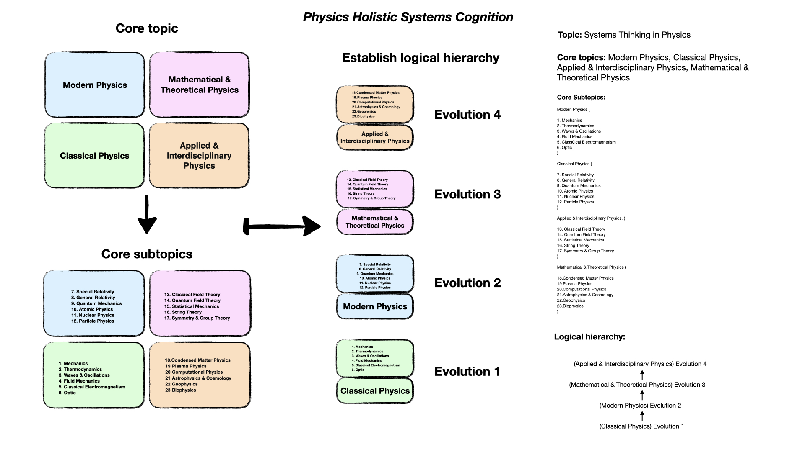
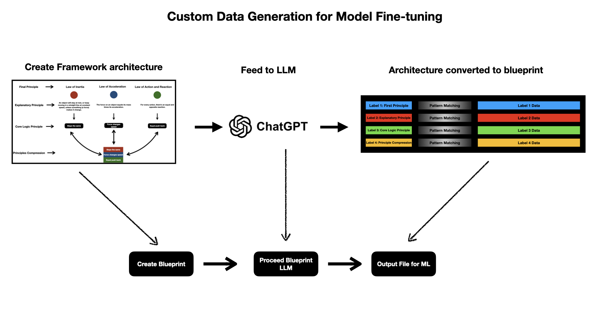
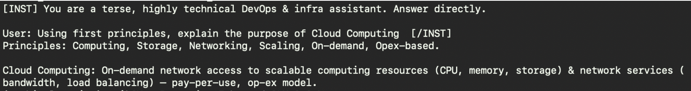
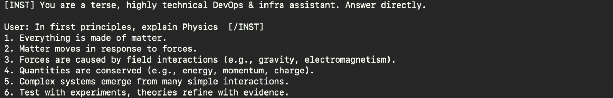
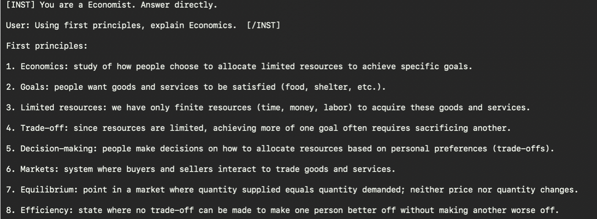

# Reasoning-Enhanced SLM 2.0

A Cognitive-Architecture Approach to Fine-Tuning Small Language Models  
Using First-Principles Reasoning, Custom Blueprint Generation, and LoRA Training  
(Model: Mistral-7B-Instruct, Local Training on Apple Silicon MPS)

---

## OVERVIEW

Reasoning-Enhanced SLM 2.0 is an applied research project exploring how to
modify the reasoning behavior of an open-weight LLM using:

- A structured reasoning architecture
- First-principles decomposition
- Blueprint-driven dataset generation
- Parameter-efficient LoRA fine-tuning
- Local training on Apple Silicon (MPS, fp16)

Unlike most fine-tuning projects that simply teach a model new content,
this project teaches the model how to think in a specific domain style:
terse, accurate, technical, DevOps-oriented reasoning.

---

## SECTION 1 — REASONING ARCHITECTURE (CORE INNOVATION)

This project introduces a **Reasoning Blueprint System** — a method for converting
domain knowledge into structured reasoning patterns that LLMs can learn reliably.

The system is visually represented in three diagram groups.

---

### 1. First Principles Thinking (Physics Example)

This diagram shows how a complex domain (physics) can be reduced into:

- Final principles
- Explanatory principles
- Core logic principles
- Compressed reasoning blocks

This provides a universal method for turning high-level knowledge into reusable
reasoning logic for machine learning datasets.

#### First Principles Reasoning Architecture

---

### 2. Physics Systems Cognition

A hierarchical decomposition of physics into conceptual layers:

- Classical Physics → Evolution 1
- Modern Physics → Evolution 2
- Theoretical Physics → Evolution 3
- Applied & Interdisciplinary Physics → Evolution 4

This turns a complex domain into a structured curriculum suitable for model training.

#### Physics Systems Cognition Diagram

This diagram demonstrates how domain knowledge can be layered to support curriculum-style dataset construction and reasoning architecture design.

---

### 3. Data Generation Blueprint Architecture

This diagram illustrates the full data pipeline used in this project:

1. Create a domain-specific reasoning framework
2. Feed the architecture to an LLM
3. The LLM converts it into a structured blueprint
4. The blueprint undergoes pattern expansion
5. The output becomes a supervised fine-tuning dataset

This system allows scalable production of structured reasoning data.

#### Custom Data Generation for Model Fine-Tuning

---

## SECTION 2 — TRAINING PIPELINE

Training steps:

1. Load Mistral-7B-Instruct on CPU in fp16
2. Move model to MPS manually (bfloat16 unsupported on Apple Silicon)
3. Load tokenizer (SentencePiece-based, non-fast)
4. Inject LoRA adapters using PEFT
5. Train using TRL's SFTTrainer
6. Save LoRA adapter weights

Training runs fully on Apple Silicon (M4/M3/M2) using MPS acceleration.

---

## SECTION 3 — DATASET FORMAT

Dataset stored in `reasoning_dataset.jsonl`, using an OpenAI-style message format:

{
"messages": [
{"role": "system", "content": "..."},
{"role": "user", "content": "..."},
{"role": "assistant", "content": "..."}
]
}

---

## SECTION 4 — LOADED MODEL AND TRAINING OUTPUT

- Model: Mistral-7B-Instruct-v0.3
- Adapter: LoRA (r=16, alpha=32, dropout=0.05)
- Device: Apple MPS (fp16)

Output directory:

mistral-7b-devops-lora/
│
├── adapter_config.json  
├── adapter_model.bin  
└── tokenizer/

Adapters can be merged or applied at inference time using PEFT.

---

## SECTION 5 — EXAMPLE POST-FINETUNE OUTPUT

Prompt:
Explain why a /16 VPC is usually split into multiple /24 subnets.

Model Output (LoRA-tuned):
To reduce broadcast domain size, minimize ARP noise, and segment workloads cleanly.
Smaller /24 blocks isolate services (public, private, DB, mgmt), simplify routing,
and support scalable multi-AZ layouts.

This demonstrates the intended terse, precise DevOps reasoning style.

---

## SECTION 6 — WHY THIS PROJECT MATTERS

Most fine-tuning projects adjust **content**.  
This project adjusts **cognition**.

It demonstrates:

- First-principles reasoning compression
- System-level decomposition of knowledge
- Automated blueprint-to-dataset generation
- Local LoRA-based behavioral alignment
- Architecture-level thinking for ML systems

This aligns more with _applied alignment research_ than standard ML fine-tuning.

---

## SECTION 7 — FUTURE WORK

- Add DPO for preference-based refinement
- Add reward modeling for multi-step reasoning
- Expand blueprint generator into an automated system
- Evaluate reasoning drift and alignment stability
- Fine-tune additional domains (physics, CS, finance, DevOps)

---

## SECTION 8 — POST-FINETUNE VISUAL EVIDENCE

### 1. Structured DevOps Reasoning

The model demonstrates concise, principle-driven explanation patterns learned from the dataset, avoiding the verbosity typical of base models.

### 2. Deductive Reasoning Behavior (Physics)

The model applies first-principles decomposition without explicit chain-of-thought prompting, showing that the _structure_ of reasoning has been internalized.

### 3. Multi-Step Compression (Economics)

The model demonstrates the "compressed logic" architecture taught during training, breaking complex social science topics into atomic constraints and goals.

## LICENSE

MIT License
